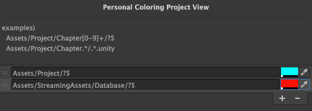
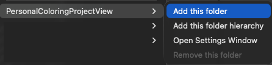
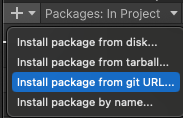
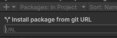

# Unity Personal Coloring Project View

Unity Personal Coloring Project View is an editor extension that colors items in the Unity Project window by asset path.

It is useful when you want to visually separate folders, scenes, chapters, modules, or any other project areas without changing your actual asset structure.





## Features

- Color Project window items by asset path pattern.
- Use regular expressions for flexible matching.
- Add folder rules directly from the Project window context menu.
- Add either a single folder rule or a folder hierarchy rule.
- Remove generated folder rules from the Project window context menu.
- Reorder rules in the settings window.
- Undo / Redo support for item add and remove operations.
- Personal local settings saved outside the project.

## Usage

Open the settings window from:

```text
Window > Personal Coloring Project View
```

You can also open it from the Project window context menu:

```text
Assets > PersonalColoringProjectView > Open Settings Window
```

Each rule has:

- `Path Pattern`: A regular expression matched against the Unity asset path.
- `Color`: The color drawn over matching Project window rows.

Rules are evaluated from top to bottom. The first matched rule is used.

## Project window context menu

Right-click a folder asset in the Project window and select:

```text
Assets > PersonalColoringProjectView > Add this folder
Assets > PersonalColoringProjectView > Add this folder hierarchy
Assets > PersonalColoringProjectView > Remove this folder
```

### Add this folder

Adds a rule that matches only the selected folder.

Example for `Assets/Project/Chapter01`:

```regex
^Assets/Project/Chapter01/?$
```

### Add this folder hierarchy

Adds a rule that matches the selected folder and everything below it.

Example for `Assets/Project/Chapter01`:

```regex
^Assets/Project/Chapter01(/.*)?$
```

### Remove this folder

Removes rules generated by `Add this folder` or `Add this folder hierarchy` for the selected folder.

Manually written custom regular expressions are not removed unless they exactly match the generated patterns.

## Pattern examples

Match chapter folders:

```regex
Assets/Project/Chapter[0-9]+/?$
```

Match all Unity scenes under chapter folders:

```regex
Assets/Project/Chapter.*/.*\.unity$
```

Match everything under a module folder:

```regex
^Assets/Scripts/MyModule(/.*)?$
```

## Undo / Redo

The following operations support Unity Undo / Redo:

- Add item from the settings window.
- Remove item from the settings window.
- Add folder rule from the Project window context menu.
- Remove folder rule from the Project window context menu.

Use:

```text
Edit > Undo
Edit > Redo
```

or the usual keyboard shortcuts.

## Settings storage

Settings are saved as a personal editor setting file under Unity's `Application.persistentDataPath`.

This means the coloring configuration is local to the user and is not intended to be committed into the Unity project by default.

## Installation with UPM

You can install this package from Unity Package Manager using the Git URL:

```text
https://github.com/yassy0413/UnityPersonalColoringProjectView.git
```




